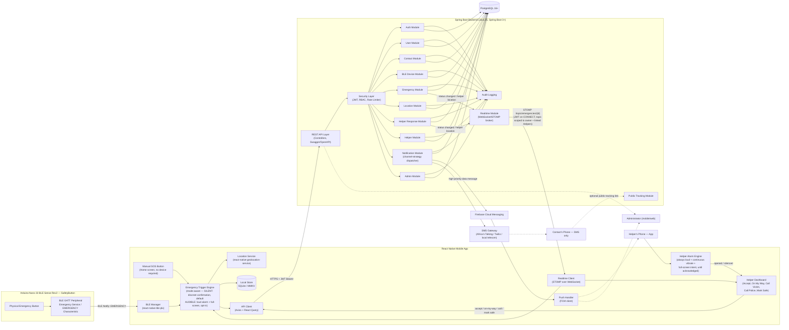
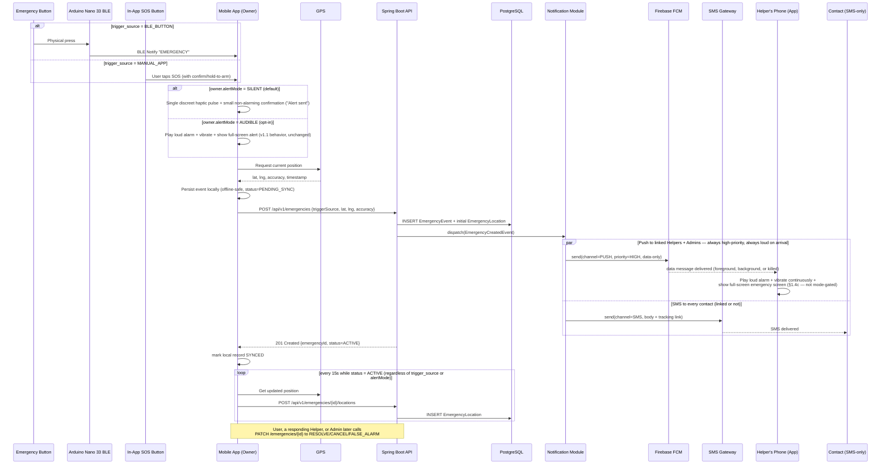
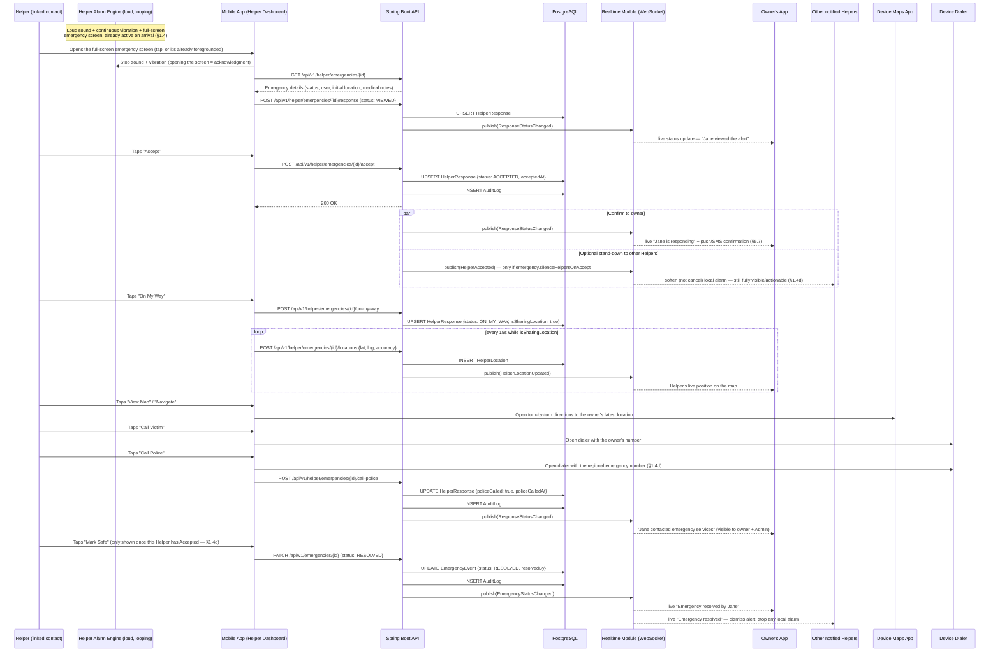
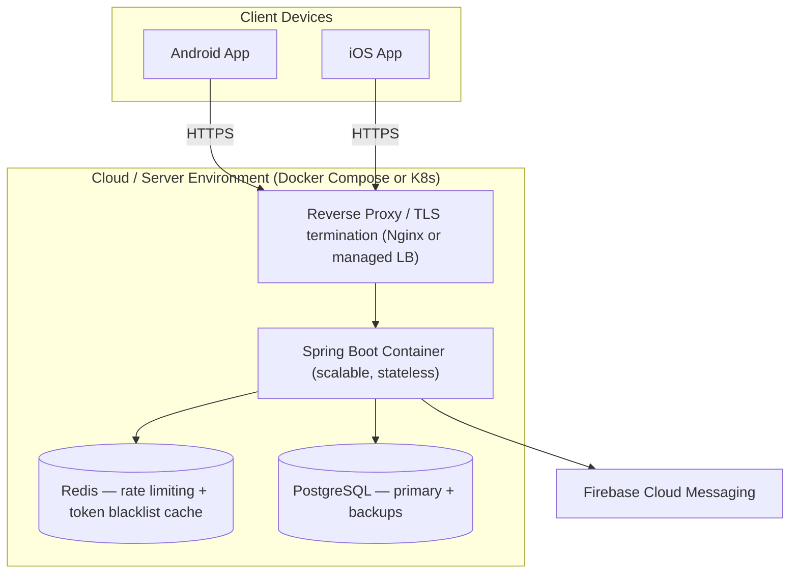
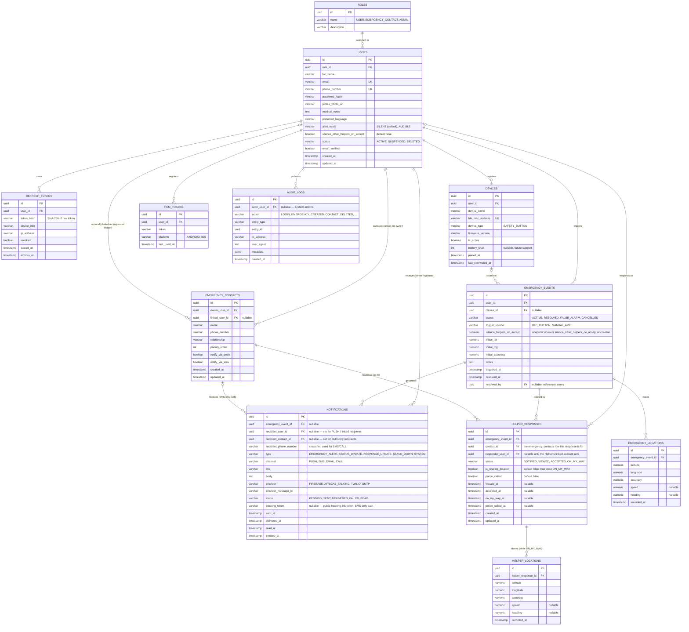
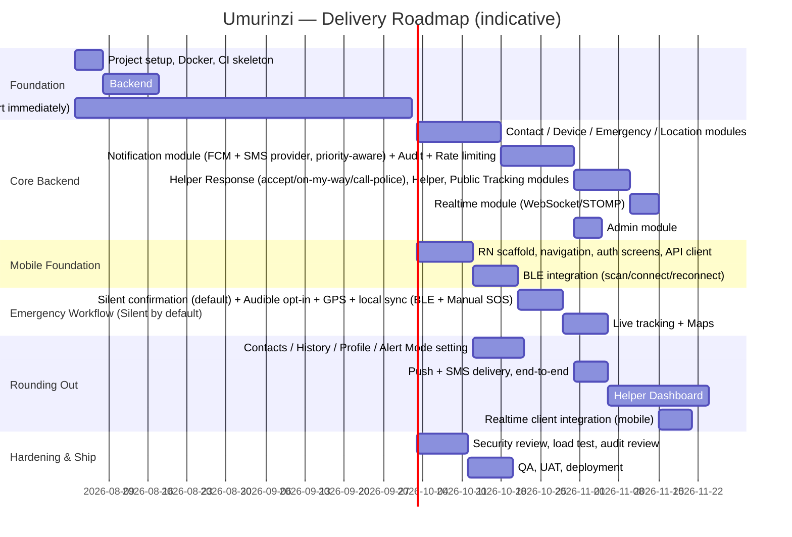

# Umurinzi Emergency Safety Alert System
### Software Design Document (SDD) — v1.3

**Status:** Draft for review
**Date:** 2026-07-20 (v1.0) · Updated 2026-07-20 (v1.1, v1.2, v1.3)
**Scope:** Steps 1–6 (Architecture → Implementation Plan). No implementation code included by design — this document is the contract the build will follow.

---

### Changelog — v1.3

**Deepens what a Helper can do once they've opened the alert — from one "I'm Responding" button to five distinct actions — and adds the real-time layer needed to keep everyone's status in sync live.**

1. **Five Helper actions**, replacing the single "I'm Responding" button from v1.1/v1.2:
   - **Accept** — marks the Helper as responding, confirms to the owner, and (optionally, off by default) softens the alarm on other notified Helpers.
   - **On My Way** — starts sharing *the Helper's own* live location with the owner (new — previously location sharing only ran owner→Helper, never the reverse).
   - **Call Victim** — unchanged from v1.1's "Call User," renamed for consistency with the other four actions.
   - **Call Police** — one-tap to the regional emergency-services number; recorded server-side for the incident record.
   - **Mark Safe** — closes the emergency, restricted to a Helper who actually engaged (Accepted or further), not any linked contact.
2. **Renamed `emergency_responses` → `helper_responses`** (and `EmergencyResponse` → `HelperResponse`) to match this vocabulary, with an expanded status set (`NOTIFIED, VIEWED, ACCEPTED, ON_MY_WAY`) and new columns for location-sharing and police-contact tracking. Renaming now, pre-implementation, rather than carrying the old name forward (see the Design note in §1.4d).
3. **New table: `helper_locations`** — the Helper-side mirror of `emergency_locations`, populated while a Helper is `ON_MY_WAY`.
4. **New real-time layer: WebSocket (STOMP) alongside FCM, not instead of it.** Status changes, stand-down broadcasts, and Helper location updates now propagate live to everyone watching an emergency, without polling. FCM keeps its existing job — waking a backgrounded/killed app — while WebSocket handles live updates once the app is actually open and watching. Rationale in §1.4d.

### Changelog — v1.2

**The primary emergency mode is now Silent Emergency — this changes the alarm behavior from v1.1, not just adds to it.**

1. **Owner-side alarm removed by default.** On BLE or Manual SOS trigger, the triggering user's own phone no longer plays a loud alarm or shows a full-screen alert by default — it captures GPS, creates the event, starts live tracking, and shows a small discreet confirmation. This directly reverses a v1.0 requirement ("play loud emergency alarm... show full-screen emergency alert" on the *user's* device); see the Design note in §1.4c for why.
2. **The loud alarm moves to the Helper's phone.** A Helper now receives a high-priority alert that plays a loud sound, vibrates continuously, and shows a full-screen emergency screen until acknowledged — with View Map, Call User, and I'm Responding actions. This is unconditional, regardless of the owner's mode.
3. **New user preference: Alert Mode** — `SILENT` (default) or `AUDIBLE`. `AUDIBLE` restores the v1.0/v1.1 owner-side loud-alarm-and-full-screen behavior for users who want it (e.g., a deterrent use case rather than a discreet one). It only affects the triggering owner's own device; it never changes what a Helper receives.
4. **Technical consequence:** delivering "loud + continuously vibrating + full-screen, until acknowledged" reliably — including waking a locked/silenced/Do-Not-Disturb phone — requires platform-specific mechanisms (Android full-screen intent notifications + a foreground service; iOS Critical Alerts, which requires a special Apple-granted entitlement) that weren't previously in scope. Flagged throughout and called out as a build risk in §8.

### Changelog — v1.1

Added before implementation begins, in response to five new requirements:

1. **SMS fallback** — emergency contacts without the app must still be alerted. Notification Module redesigned around a pluggable multi-channel sender (Push / SMS / Email-future / Call-future) with an SMS provider abstraction (Africa's Talking, Twilio, or a local telecom API).
2. **Manual SOS** — emergencies can now be triggered from inside the app with no Arduino/BLE device involved. `trigger_source` is now explicitly `BLE_BUTTON | MANUAL_APP`.
3. **Emergency Contact response workflow** — a linked (app-registered) contact can view details, see the live map, get navigation directions, call the user, and mark "I'm Responding."
4. **Helper Dashboard** — new mobile screens and backend APIs scoped to what a contact is allowed to see: active emergencies they were notified about, live tracking, their own response history, and everyone's response status.
5. **Emergency workflow enhancement** — the trigger sequence now explicitly fires push **and** SMS in parallel and confirms the 15s live-tracking cadence regardless of trigger source.

Where these additions required a structural decision not explicit in the original request, it's called out inline (search for "**Design note**") rather than silently folded in.

---

## 0. Document Purpose & Naming

"Umurinzi" (Kinyarwanda: *guardian/protector*) is used as the working project name throughout this document (package `com.umurinzi.emergency`, repo `umurinzi-app`). Rename freely before implementation if a different product name is preferred — it is a placeholder, not a requirement.

This document is organized exactly per the requested deliverables:

1. System Architecture
2. Database Schema
3. Backend Folder Structure
4. React Native Folder Structure
5. API Specification
6. Implementation Plan

Security design and cross-cutting concerns are woven through each section rather than bolted on at the end, since they affect schema, folder layout, and API contracts directly.

---

## 1. System Architecture

### 1.1 Actors & Roles

| Role | Description | Primary Surface |
|---|---|---|
| **User** | Owns a SafetyButton device, triggers/manages their own emergencies, manages their contacts and profile | Mobile app |
| **Emergency Contact ("Helper")** | A person designated by a User to be notified during emergencies. May or may not hold an app account (`linked_user_id` nullable) | Mobile app **Helper Dashboard** (if registered) / SMS-only fallback (if not) |
| **Administrator** | Monitors all emergencies, manages users/devices, views audit logs, system-wide dashboard | Mobile app (admin views) and/or a future web console (out of scope for this phase but the API is designed to support one without changes) |

**Design note — Helper access is relationship-based, not role-based.** `roles` still seeds `USER / EMERGENCY_CONTACT / ADMIN` as before (kept for onboarding UX — at signup someone can indicate "I'm protecting myself" vs. "I'm someone's contact" — and for `ADMIN`, which *is* a true global privilege). But the Helper Dashboard and response-workflow endpoints (§5.8–5.9) do **not** gate on `role = EMERGENCY_CONTACT`. They gate on whether the caller's `user.id` appears as `emergency_contacts.linked_user_id` for at least one owner. This matters because the same person is routinely both: a User protecting themselves *and* the Helper for a parent or partner. A single global role can't represent that; the relationship already captured in `emergency_contacts` can, at no schema cost. Any `USER`-role account automatically becomes a Helper the moment someone links them as a contact — no role change, no re-registration.

**Design note — two tiers of Emergency Contact.** A contact with `linked_user_id` set ("Helper") gets the full in-app response workflow (§1.4b). A contact with no linked account gets SMS-only alerting plus an optional public, token-scoped tracking link (§5.10) — no login, no in-app actions, since there's no account to attach a response to.

### 1.2 High-Level Component Diagram



### 1.3 Technology Stack

| Layer | Technology | Notes |
|---|---|---|
| Hardware | Arduino Nano 33 BLE Sense Rev2 | Custom firmware exposing a BLE GATT peripheral with an `EmergencyService`; notifies a fixed `EMERGENCY` payload on button press. Deep-sleep/low-power between presses recommended. |
| Mobile | React Native + TypeScript | Cross-platform (Android/iOS) |
| Navigation | React Navigation (native-stack + bottom-tabs) | |
| Server state | React Query (TanStack Query) | Caching, retries, background refetch |
| Client state | Zustand | Auth session, BLE connection state, active emergency state |
| HTTP | Axios | Interceptors for JWT attach + refresh-on-401 |
| BLE | react-native-ble-plx | Scan, connect, subscribe to characteristic notifications |
| Maps | react-native-maps (Google Maps provider) | |
| Geolocation | react-native-geolocation-service | Foreground + background location |
| Push | Firebase Cloud Messaging (`@react-native-firebase/messaging`) | Sent as high-priority **data** messages (not notification-display messages) for Helper alerts, so the app — not the OS's default tray — controls sound/vibration/full-screen presentation, including when backgrounded or killed |
| Helper alarm delivery (Android) | Full-screen intent notification + foreground service | Required to reliably wake a locked screen and loop a loud sound/vibration pattern "until acknowledged" (§1.4c) |
| Helper alarm delivery (iOS) | Critical Alerts (`UNNotificationSound.defaultCritical`) | The **only** iOS mechanism that can sound and vibrate through Silent Mode / Do Not Disturb; requires a dedicated entitlement Apple grants case-by-case — a build risk, see §8 |
| Local persistence | SQLite (`op-sqlite` or `react-native-sqlite-storage`) | Offline-safe emergency event queue, synced on reconnect |
| Real-time client | `@stomp/stompjs` over native `WebSocket` | No SockJS shim needed — that's a browser-compatibility layer; React Native's built-in WebSocket support talks STOMP directly (§1.4d) |
| Backend | Java 25, Spring Boot 3+ | |
| Security | Spring Security 6, JWT (access + refresh) | |
| Persistence | Spring Data JPA / Hibernate | |
| Migrations | Flyway | Versioned, repeatable SQL migrations |
| API docs | springdoc-openapi (Swagger UI) | |
| Real-time (server side) | `spring-boot-starter-websocket` (STOMP over WebSocket, SockJS fallback for any future web client) | One broker topic per emergency (`/topic/emergencies/{id}`); JWT validated on STOMP CONNECT via a `ChannelInterceptor`, topic subscription re-checked against the same ownership/`HelperAccessGuard` rules as the REST API (§6) |
| Database | PostgreSQL 16+ | PostGIS extension optional for geo-queries at scale |
| Push (server side) | Firebase Admin SDK | |
| SMS (server side) | Pluggable `SmsProviderClient` interface — Africa's Talking (primary, East Africa coverage) and/or Twilio (international), selected via config | Neither vendor is hard-wired into domain code; the Notification Module only depends on the interface (§3, §6) |
| Containerization | Docker + Docker Compose | App, DB, (optional) pgAdmin, Redis |
| Rate limiting | Bucket4j (+ Redis for distributed limiting) | |
| Caching / rate-limit store | Redis (optional but recommended) | |

### 1.4 Core Data Flow — Emergency Trigger

Two trigger sources feed the same pipeline from the point of "we have a lat/lng and a reason" onward — the only difference is what happens *before* that point.



**Offline resilience:** if the POST to `/emergencies` fails (no connectivity), the event stays `PENDING_SYNC` in local SQLite; GPS capture, local save, and the owner's on-screen confirmation (silent or audible) all still run entirely client-side (they must never depend on network availability), and a background sync job retries until the backend acknowledges it. This is the single most important reliability requirement in the whole system — a life-safety trigger must work regardless of connectivity, and regardless of whether a BLE device is even paired.

**Why push and SMS fire in parallel, not SMS-as-fallback-after-push-fails:** waiting to detect a push failure (device off, no data, app uninstalled) before trying SMS costs the one resource that matters most in an emergency — time. Every contact gets whichever channels are appropriate for them (linked contacts: push, always; every contact regardless of link status: SMS) at the same instant. §5.7 and §3 detail the dispatcher that fans this out.

### 1.4b Helper Response Workflow

Picks up exactly where the Helper Alarm Engine in §1.4 left off — the loud alarm is already sounding when this begins. Five actions are available once the alert is open; not all are always shown (§1.4d has the exact rules), but this trace shows a Helper who uses all five.



### 1.4c Silent vs. Audible Trigger Mode

**The default is Silent Emergency.** On trigger, the *owner's own device* never assumes a loud alarm is safe — a visible, audible emergency screen on the phone of someone being followed, restrained, or otherwise unsafe to be seen calling for help can escalate the danger they're already in. So by default:

| | Owner's device (this section) | Helper's device (§1.4b) |
|---|---|---|
| Sound | None | Loud, looping, until acknowledged |
| Vibration | None (or a single confirmation pulse) | Continuous, until acknowledged |
| Screen | Small discreet confirmation ("Alert sent"); the app otherwise looks normal | Full-screen emergency takeover |
| Gated by `alertMode`? | Yes — `AUDIBLE` restores the loud/full-screen v1.1 behavior | No — always loud, regardless of the owner's mode |

**Design note — why the Helper side is never silent, even when the owner chose `AUDIBLE`.** The owner's `alertMode` describes what's safe to reveal *at the owner's location*, which has nothing to do with what's safe or useful at the Helper's location. A Helper who isn't in danger needs the strongest possible attention-grabbing signal to respond fast — muting that because the owner separately chose a quiet trigger experience would trade the Helper's response time for no safety benefit to anyone. The two settings are deliberately independent, not one flag propagated through the system.

**Design note — `AUDIBLE` is not "the old default with a new name."** It's an intentional opt-in for a different threat model: someone who *wants* a loud alarm as a deterrent (scare off a threat, alert bystanders) rather than a discreet signal (get help without the trigger being noticed). Both are legitimate; the requirement is that discreet is what a user gets without having to know to ask for it.

**User preference:** stored as `users.alert_mode` (`SILENT` default, `AUDIBLE`), editable via `PATCH /users/me` (§5.2). It is a per-account setting, not per-device or per-emergency — simplest mental model, and consistent with `preferred_language`/`medical_notes` already living on the profile.

### 1.4d Helper Actions & Real-Time Updates

**The five actions, and what each one actually does:**

| Action | Effect | Who can do it |
|---|---|---|
| **Accept** | `HelperResponse.status → ACCEPTED`; owner gets a confirmation (push + the notification the Notification Module would otherwise send); optionally softens (never fully cancels) the alarm on other notified Helpers | Any linked Helper who has at least `VIEWED` the alert |
| **On My Way** | `status → ON_MY_WAY`, `isSharingLocation → true`; the Helper's own device starts posting location pings the owner (and other Helpers) can see on the map | A Helper who has `ACCEPTED` |
| **Call Victim** | Opens the native dialer pre-filled with the owner's stored phone number. Purely client-side — no API call, identical to v1.1/v1.2's "Call User" | Any linked Helper |
| **Call Police** | Opens the native dialer pre-filled with the regional emergency-services number, **then** records the action server-side for the incident record | Any linked Helper |
| **Mark Safe** | Calls the existing `PATCH /emergencies/{id} {status: RESOLVED}` (§5.5) — there is no separate "safe" state, this *is* the owner-side resolution, just triggered by a Helper instead of the owner | A Helper who has `ACCEPTED` or further (not any linked contact — see the Design note below) |

**Design note — renaming `emergency_responses` → `helper_responses`.** The v1.1/v1.2 table already modeled exactly this concept (a linked contact's reaction to an emergency) but under emergency-centric naming (`EmergencyResponse`, statuses `NOTIFIED/VIEWED/RESPONDING`). Now that the vocabulary is explicitly Helper-action-centric (Accept, On My Way...), carrying the old name forward would leave the schema and the product vocabulary permanently out of sync. Renaming now, while nothing is implemented yet, costs nothing; renaming after Phase 4 ships would cost a migration and a compatibility window. `RESPONDING` becomes `ACCEPTED` (same meaning, matches the new button label); `ON_MY_WAY` is new.

**Design note — "stand down other Helpers" softens, it never fully cancels.** `users.silence_other_helpers_on_accept` (default **off**) is a per-owner preference, snapshotted onto the emergency at creation (`emergency_events.silence_helpers_on_accept`) so changing the preference mid-emergency can't retroactively alter an event already in flight. Even when on, an Accept only stops the *sound and vibration* on other Helpers' devices — the full-screen alert stays visible with a "Jane is already responding — you can still help" banner, and every other action (On My Way, Call Victim, Call Police) remains available. Fully cancelling other Helpers' alerts on one Accept would mean a single tap — possibly a mis-tap, possibly from someone who never shows up — silently removes everyone else's chance to help. Softening keeps the safety margin; only the noise goes away.

**Design note — Mark Safe is restricted to an engaged Helper.** Any linked Helper could resolve an emergency in v1.1/v1.2's permission model (§5.5: "linked Helper (RESOLVE/FALSE_ALARM only)"). v1.3 narrows that specifically for Helpers: only one who has themselves reached `ACCEPTED` (i.e., actually engaged, not just a bystander who received the alert) can close it out. This doesn't apply to the owner or Admin, who can always resolve their own/any emergency — it's specifically about preventing an uninvolved Helper from closing someone else's emergency they never actually checked on.

**Real-time updates — WebSocket for what's live, FCM for what's asleep.** These aren't redundant channels; they cover different states of the recipient's app:

| | FCM (existing, §1.4/§5.7) | WebSocket / STOMP (new) |
|---|---|---|
| Works when app is... | Backgrounded or killed | Foregrounded and subscribed |
| Latency / overhead | Higher, provider-mediated, fine for "wake up, something happened" | Low, held-open connection — fine for "update this screen every few seconds" |
| Used for | Initial `HELPER_ALARM` alert; stand-down notice to a backgrounded Helper; owner/Admin notifications | Live status badges, "who's responding" list, Helper location pings while `ON_MY_WAY`, live emergency resolution |

A Helper's device typically uses both in sequence during one emergency: FCM wakes the app and sounds the alarm (§1.4); once the Helper opens the alert, the app connects to `/topic/emergencies/{id}` over WebSocket and everything from that point — the owner accepting a different Helper, another Helper's live position, the emergency being marked safe — arrives over that socket instead. If the socket drops, the client falls back to polling the existing REST endpoints (§5.5, §5.6, §5.8) rather than failing silently.

### 1.5 Deployment Architecture



Environments: `dev` (docker-compose, local Postgres), `staging`, `prod` — each with its own `application-{profile}.yml`, Flyway-managed schema, and separate Firebase project. Backend is stateless (JWT-based) so it horizontally scales behind a load balancer without sticky sessions.

### 1.6 Key Architectural Decisions

| Decision | Rationale |
|---|---|
| BLE parsing and alarm triggering happen **entirely on-device** in the app, not round-tripped through the backend first | An emergency alarm must fire even with zero connectivity; the backend sync is best-effort and asynchronous |
| Access/refresh JWT pair, refresh tokens stored server-side (hashed) in `refresh_tokens` table | Enables revocation (logout, admin-forced logout) which pure stateless JWT can't do |
| Feature-based (vertical slice) folder structure on both backend and mobile, not layer-based | Each module (Emergency, Contacts, Devices...) maps 1:1 to a domain concept in the ERD and to a team's area of ownership; scales better than `controllers/`, `services/`, `repositories/` siloed by technical layer |
| `EmergencyContacts` is a table of contact records (with an optional `linked_user_id`), not solely a role assignment | A contact is frequently a family member who has no app account yet; the system must still be able to notify them (SMS/push-to-install-link) and later "claim" the link once they register |
| Live tracking stored as an append-only `emergency_locations` table keyed by `emergency_event_id` | Cheap writes every 15s, natural history/movement replay, no update contention |
| Redis introduced for rate limiting and refresh-token/blacklist cache | Bucket4j's distributed mode needs a shared store once there's more than one backend instance; avoids the rate limit being per-instance-only |
| Notification dispatch uses a channel-strategy pattern (`NotificationChannelSender` per channel) fanned out from one `NotificationDispatcher`, not per-module ad-hoc FCM/SMS calls | Email and Phone Call are explicitly "future" channels in the requirements; the interface has to exist now so adding them later is a new class, not a rewrite. Also lets SMS providers (Africa's Talking / Twilio / local telecom) be swapped via config, not code |
| Helper Dashboard access is derived from the `emergency_contacts.linked_user_id` relationship, not the static `EMERGENCY_CONTACT` role | See the Design note in §1.1 — a person is simultaneously a User (self) and a Helper (for someone else); a single global role can't express that, the existing relationship table already can |
| SMS-only (unregistered) contacts get a short-lived, token-scoped **public tracking link** instead of the in-app Helper workflow | They have no account to authenticate or attach an Accept/On My Way response to. A read-only, expiring, unauthenticated-but-unguessable link is the minimum viable way to honor "contacts should receive alerts even without the app" without exposing tracking data indefinitely or to the wrong person (§5.10, §6) |
| Manual SOS reuses the exact same `POST /emergencies` contract as a BLE trigger, differing only in `triggerSource` | Keeps one emergency pipeline instead of two; the GPS/local-save/sync/notify/track logic in §1.4 doesn't fork based on how the emergency started — only the owner-side presentation (§1.4c) forks, and only on `alertMode`, never on `triggerSource` |
| Owner-side alarm and Helper-side alarm are two independent switches, not one setting propagated end-to-end | See the Design notes in §1.4c. Conflating them would either silence the one alert that must never be silent (the Helper's) or force loudness on a device where that could be dangerous (the owner's) |
| Helper alerts are sent as FCM **data** messages, not notification-display messages, and are delivered via platform-native "break through everything" primitives (Android full-screen intent + foreground service; iOS Critical Alerts) | A standard push notification can be silenced by the OS, batched, or simply not shown over a lock screen — none of which is acceptable for "loud, continuously vibrating, full-screen, until acknowledged." This is a materially harder mobile engineering problem than a normal push and is scoped as such (§7, §8) |
| Renamed `emergency_responses`/`EmergencyResponse` → `helper_responses`/`HelperResponse`, with `RESPONDING` → `ACCEPTED` | See the Design note in §1.4d — the product vocabulary is now explicitly Helper-action-centric; renaming pre-implementation is free, renaming post-launch isn't |
| A second real-time channel (WebSocket/STOMP) was added alongside FCM rather than trying to make FCM carry live updates too | FCM is a wake/notify mechanism, not a low-latency live-update one; forcing 15s-cadence Helper location pings or instant status badges through FCM would be slow, wasteful, and still wouldn't help a foregrounded app that just wants a live feed (§1.4d) |
| "Stand down other Helpers" is a per-owner preference, defaults **off**, and only ever softens (stops sound/vibration) rather than cancels other Helpers' alerts | A single Accept tap shouldn't be able to silently remove every other Helper's chance to respond if the accepting Helper doesn't actually show up (§1.4d) |
| "Mark Safe" is the existing `PATCH /emergencies/{id}` resolve transition, not a new state — but for Helpers specifically, it's now gated on having reached `ACCEPTED` | Reuses the state machine that already exists (§5.5) instead of inventing a parallel one, while closing a real gap: an uninvolved linked contact shouldn't be able to close out an emergency they never engaged with |

---

## 2. Database Schema

### 2.1 Entity-Relationship Diagram



> Four tables (`FCM_TOKENS`, `AUDIT_LOGS`, `HELPER_RESPONSES`, `HELPER_LOCATIONS`) are additions beyond the eight originally requested entities. They're structurally required: `FCM_TOKENS` is where per-device push tokens live (a user can have multiple installs), `AUDIT_LOGS` is what the "Audit Logging" security requirement actually persists to, `HELPER_RESPONSES` is what the Helper response workflow (Accept / On My Way / Call Police / Mark Safe) persists to and reads from (renamed from `EMERGENCY_RESPONSES` in v1.3 — §1.4d), and `HELPER_LOCATIONS` is the new v1.3 table backing "On My Way" live location sharing. Flagging them explicitly rather than silently expanding scope.

### 2.2 Table Reference

**roles** — static reference table, seeded via Flyway (`USER`, `EMERGENCY_CONTACT`, `ADMIN`).

**users** — one row per account. `email` and `phone_number` unique + indexed. `password_hash` uses BCrypt/Argon2. `status` drives login eligibility (`SUSPENDED`/`DELETED` block auth). Soft-delete via `status`, not row deletion, to preserve FK integrity in `emergency_events` history. `alert_mode` (default `SILENT`) governs only what *this account's own device* does when *it* triggers an emergency (§1.4c) — it has no bearing on what any Helper receives, which is why it lives here on the profile rather than on `emergency_events` or `notifications`.

**refresh_tokens** — supports rotation: on refresh, the old token is marked `revoked = true` and a new row is inserted (never update-in-place a live token). Indexed on `user_id` and `token_hash`. A scheduled job purges expired+revoked rows past a retention window.

**devices** — a User's paired SafetyButton(s). `ble_mac_address` unique so the same physical device can't be double-registered to two accounts. `is_active` flips false on unpair.

**emergency_contacts** — owned by `owner_user_id` (the protected user). `linked_user_id` is populated once the contact's phone/email matches a registered account — that's the flag that upgrades a contact from "SMS-only" to "Helper" (§1.1 Design note). `priority_order` controls notification sequencing/display order. Composite index on `(owner_user_id, priority_order)`.

**emergency_events** — the core record. `status` state machine: `ACTIVE → RESOLVED | FALSE_ALARM | CANCELLED` (one-way transitions, enforced in the service layer, not just the DB). `trigger_source` is exactly `BLE_BUTTON | MANUAL_APP` — the manual value covers the in-app SOS button, and `device_id` is nullable specifically because `MANUAL_APP` events have no paired hardware. `silence_helpers_on_accept` is copied from `users.silence_other_helpers_on_accept` at creation time and never re-read from the profile afterward, so changing the preference mid-emergency can't alter an event already in flight (§1.4d). Index on `(user_id, status)` and `(status, triggered_at)` for admin monitoring queries.

**emergency_locations** — append-only track log for an event, populated by the *owner's* device. Index on `(emergency_event_id, recorded_at)`. Retained indefinitely for now (part of the incident record); a future retention policy can archive events older than N months.

**notifications** — outbox/log for every push/SMS/email/call fired, keyed to the emergency (nullable for non-emergency notifications like "contact added you"). Exactly one of `recipient_user_id` / `recipient_contact_id` is set per row (DB check constraint) — the former for push/in-app recipients, the latter for SMS-only contacts who have no `users` row at all. `provider_message_id` (generalized from a single FCM-only field) lets delivery-status webhooks from *any* channel/provider reconcile back to a row. `tracking_token` is populated only on the SMS-only path, mirroring the token minted in `public tracking` (§5.10). `type = STAND_DOWN` (new in v1.3) is the record of a soften-other-Helpers broadcast — logged even though its primary delivery is real-time (§1.4d), so there's still an auditable/queryable trail of who was told to stand down and when.

**fcm_tokens** — per-installation push token, upserted on app login/token-refresh. Old tokens are pruned when FCM reports `NotRegistered`.

**helper_responses** *(renamed from `emergency_responses` in v1.3 — §1.4d)* — one row per `(emergency_event_id, contact_id)`, unique-constrained on that pair. Created (status `NOTIFIED`) the moment a notification is dispatched to a *linked* contact; progresses through `VIEWED → ACCEPTED → ON_MY_WAY` via the Helper Response Module (§5.8), each transition stamping its own `*_at` column rather than overwriting a single generic `responded_at` — needed now that there are multiple meaningful milestones to reconstruct later (e.g., "how long between notified and accepted"), not just one. `responder_user_id` is populated from the caller's JWT the first time they act — kept separate from `contact_id` because the same person can be a Helper via more than one `emergency_contacts` row (e.g., listed by two different family members). `is_sharing_location` and the `police_called*` columns are the state backing "On My Way" and "Call Police" respectively (§1.4d).

**helper_locations** *(new in v1.3)* — append-only track log for a Helper's own position, the mirror of `emergency_locations` but scoped to `helper_response_id` instead of directly to the emergency (since more than one Helper can be `ON_MY_WAY` simultaneously, each needs their own track, not one shared list). Index on `(helper_response_id, recorded_at)`. Only written while the owning `helper_responses.is_sharing_location = true`.

**audit_logs** — append-only, no updates/deletes. `metadata` (JSONB) holds action-specific context (e.g., old/new values on a profile edit). This table backs the "Audit Logging" security requirement and the Admin module's activity views.

### 2.3 Constraints & Indexing Summary

- All primary keys: `UUID` (generated via `gen_random_uuid()` / DB default), not auto-increment — avoids leaking sequential IDs and simplifies future multi-region/offline-ID generation on the mobile client.
- All FKs `ON DELETE RESTRICT` by default, except: `emergency_locations.emergency_event_id`, `notifications.*`, `helper_responses.emergency_event_id`, and `helper_locations.helper_response_id` use `ON DELETE CASCADE` from their parent where the child is purely dependent data.
- `emergency_contacts.linked_user_id`, `emergency_events.device_id`, `notifications.recipient_user_id`, `notifications.recipient_contact_id`, and `helper_responses.responder_user_id` are the nullable FKs.
- `CHECK (recipient_user_id IS NOT NULL OR recipient_contact_id IS NOT NULL)` on `notifications` — every notification must be addressable to *someone*.
- `UNIQUE (emergency_event_id, contact_id)` on `helper_responses`.
- `CHECK (police_called_at IS NOT NULL OR police_called = false)` and equivalent for `accepted_at`/`on_my_way_at` against their booleans/status on `helper_responses` — a milestone timestamp is only ever set alongside the status transition it records, never independently.
- Every table has `created_at` (and `updated_at` where mutable), managed via Hibernate `@CreationTimestamp`/`@UpdateTimestamp` or Flyway-defined `DEFAULT now()`.
- Flyway migration `V1__init_schema.sql` creates all tables + `V2__seed_roles.sql` seeds the three roles. The v1.1 additions ship as `V3__notification_channels_and_responses.sql` (now creating `helper_responses` directly under its v1.3 name, since this document renamed it before any migration was ever run); the v1.2 addition (`users.alert_mode`) ships as `V4__user_alert_mode.sql`; the v1.3 additions — `helper_responses`' new columns/status values, the `helper_locations` table, `users.silence_other_helpers_on_accept`, `emergency_events.silence_helpers_on_accept`, and `notifications.type = STAND_DOWN` — ship as `V5__helper_response_workflow.sql`. Subsequent changes are additive versioned migrations — no destructive schema edits in place.

---

## 3. Backend Folder Structure (Spring Boot)

Feature-based ("vertical slice") layout — each module owns its controller, service, repository, entity, and DTOs. This maps directly to the modules in the requirements (Auth, User, Emergency, Contact, Location, Notification, BLE Device, Admin) and to the ERD above. v1.1 adds three modules: `response` (tracks a Helper's reaction to an emergency), `helper` (read-scoped APIs for what a Helper is allowed to see), and `tracking` (the unauthenticated public link for SMS-only contacts). v1.3 adds `realtime` (the WebSocket/STOMP layer, §1.4d) and substantially expands `response`.

```
backend/
├─ src/
│  ├─ main/
│  │  ├─ java/com/umurinzi/emergency/
│  │  │  ├─ EmergencyApplication.java
│  │  │  │
│  │  │  ├─ config/
│  │  │  │  ├─ SecurityConfig.java
│  │  │  │  ├─ SwaggerConfig.java
│  │  │  │  ├─ CorsConfig.java
│  │  │  │  ├─ RateLimitConfig.java
│  │  │  │  ├─ FirebaseConfig.java
│  │  │  │  ├─ RedisConfig.java
│  │  │  │  └─ JacksonConfig.java
│  │  │  │
│  │  │  ├─ common/
│  │  │  │  ├─ entity/BaseEntity.java
│  │  │  │  ├─ dto/ApiResponse.java
│  │  │  │  ├─ dto/PageResponse.java
│  │  │  │  ├─ exception/ (ApiException, NotFoundException, GlobalExceptionHandler, ErrorCode)
│  │  │  │  └─ util/ (DateUtils, GeoUtils)
│  │  │  │
│  │  │  ├─ security/
│  │  │  │  ├─ jwt/JwtTokenProvider.java
│  │  │  │  ├─ jwt/JwtAuthenticationFilter.java
│  │  │  │  ├─ UserPrincipal.java
│  │  │  │  ├─ CustomUserDetailsService.java
│  │  │  │  ├─ RateLimitingFilter.java
│  │  │  │  └─ annotation/ (@RequireRole, @CurrentUser)
│  │  │  │
│  │  │  ├─ role/
│  │  │  │  ├─ Role.java
│  │  │  │  └─ RoleRepository.java
│  │  │  │
│  │  │  ├─ auth/
│  │  │  │  ├─ AuthController.java
│  │  │  │  ├─ AuthService.java
│  │  │  │  ├─ RefreshToken.java
│  │  │  │  ├─ RefreshTokenRepository.java
│  │  │  │  └─ dto/ (RegisterRequest, LoginRequest, TokenResponse, RefreshRequest, ForgotPasswordRequest, ResetPasswordRequest)
│  │  │  │
│  │  │  ├─ user/
│  │  │  │  ├─ User.java
│  │  │  │  ├─ AlertMode.java (enum: SILENT, AUDIBLE)
│  │  │  │  ├─ UserRepository.java
│  │  │  │  ├─ UserController.java
│  │  │  │  ├─ UserService.java
│  │  │  │  ├─ dto/ (UserProfileResponse, UpdateProfileRequest — includes alertMode)
│  │  │  │  └─ mapper/UserMapper.java
│  │  │  │
│  │  │  ├─ contact/
│  │  │  │  ├─ EmergencyContact.java
│  │  │  │  ├─ EmergencyContactRepository.java
│  │  │  │  ├─ EmergencyContactController.java
│  │  │  │  ├─ EmergencyContactService.java
│  │  │  │  └─ dto/ (ContactRequest, ContactResponse)
│  │  │  │
│  │  │  ├─ device/
│  │  │  │  ├─ Device.java
│  │  │  │  ├─ DeviceRepository.java
│  │  │  │  ├─ DeviceController.java
│  │  │  │  ├─ DeviceService.java
│  │  │  │  └─ dto/ (RegisterDeviceRequest, DeviceResponse)
│  │  │  │
│  │  │  ├─ emergency/
│  │  │  │  ├─ EmergencyEvent.java
│  │  │  │  ├─ EmergencyStatus.java (enum)
│  │  │  │  ├─ TriggerSource.java (enum: BLE_BUTTON, MANUAL_APP)
│  │  │  │  ├─ EmergencyEventRepository.java
│  │  │  │  ├─ EmergencyController.java
│  │  │  │  ├─ EmergencyService.java
│  │  │  │  ├─ event/ (EmergencyCreatedEvent, EmergencyStatusChangedEvent — Spring application events)
│  │  │  │  └─ dto/ (CreateEmergencyRequest, UpdateEmergencyRequest, EmergencyResponse, EmergencyHistoryResponse)
│  │  │  │
│  │  │  ├─ location/
│  │  │  │  ├─ EmergencyLocation.java
│  │  │  │  ├─ EmergencyLocationRepository.java
│  │  │  │  ├─ LocationController.java
│  │  │  │  ├─ LocationService.java
│  │  │  │  └─ dto/ (LocationPingRequest, LocationTrackResponse)
│  │  │  │
│  │  │  ├─ response/                                (renamed conceptually to "Helper Response Module" in v1.3 — §1.4d)
│  │  │  │  ├─ HelperResponse.java                    (was EmergencyResponse.java)
│  │  │  │  ├─ ResponseStatus.java (enum: NOTIFIED, VIEWED, ACCEPTED, ON_MY_WAY — was NOTIFIED, VIEWED, RESPONDING)
│  │  │  │  ├─ HelperLocation.java                    (new — the Helper-side mirror of location.EmergencyLocation)
│  │  │  │  ├─ HelperResponseRepository.java
│  │  │  │  ├─ HelperLocationRepository.java
│  │  │  │  ├─ HelperResponseController.java          (new — accept / on-my-way / locations / call-police live here, alongside the existing generic status-upsert endpoint)
│  │  │  │  ├─ HelperResponseService.java
│  │  │  │  ├─ event/ (ResponseStatusChangedEvent, HelperLocationUpdatedEvent, HelperAcceptedEvent — consumed by NotificationDispatcher, RealtimeEventPublisher, and AuditEventListener independently)
│  │  │  │  └─ dto/ (SubmitResponseRequest, AcceptRequest, OnMyWayRequest, HelperLocationPingRequest, CallPoliceRequest, ResponseStatusListResponse)
│  │  │  │
│  │  │  ├─ notification/
│  │  │  │  ├─ Notification.java
│  │  │  │  ├─ NotificationChannel.java (enum: PUSH, SMS, EMAIL, CALL)
│  │  │  │  ├─ NotificationRepository.java
│  │  │  │  ├─ FcmToken.java
│  │  │  │  ├─ FcmTokenRepository.java
│  │  │  │  ├─ NotificationController.java
│  │  │  │  ├─ NotificationService.java
│  │  │  │  ├─ NotificationDispatcher.java        (fans an event out across every applicable channel sender)
│  │  │  │  ├─ NotificationPriority.java (enum: NORMAL, HELPER_ALARM — HELPER_ALARM forces FCM data-message + high-priority delivery, §1.4c)
│  │  │  │  ├─ channel/
│  │  │  │  │  ├─ NotificationChannelSender.java  (interface: send(Notification))
│  │  │  │  │  ├─ PushNotificationSender.java      (wraps FcmPushService; sets priority=HELPER_ALARM only for Helper recipients, never for the owner's own confirmation)
│  │  │  │  │  ├─ SmsNotificationSender.java        (wraps SmsProviderClient)
│  │  │  │  │  ├─ EmailNotificationSender.java      (future — SMTP, currently a stub)
│  │  │  │  │  └─ CallNotificationSender.java       (future — voice/IVR, currently a stub)
│  │  │  │  ├─ push/FcmPushService.java             (sends HELPER_ALARM pushes as data-only messages — no `notification` block — so the client's own foreground service/full-screen intent controls presentation, not the OS tray)
│  │  │  │  ├─ sms/
│  │  │  │  │  ├─ SmsProviderClient.java            (interface: send(phoneNumber, body) -> providerMessageId)
│  │  │  │  │  ├─ AfricasTalkingSmsProviderClient.java
│  │  │  │  │  ├─ TwilioSmsProviderClient.java
│  │  │  │  │  └─ SmsDeliveryCallbackController.java (provider webhook → updates notification status)
│  │  │  │  └─ dto/ (RegisterFcmTokenRequest, NotificationResponse, SmsCallbackPayload)
│  │  │  │
│  │  │  ├─ tracking/
│  │  │  │  ├─ TrackingTokenService.java   (mint/validate short-lived opaque tokens)
│  │  │  │  ├─ PublicTrackingController.java (unauthenticated, rate-limited, read-only)
│  │  │  │  └─ dto/ (PublicTrackingResponse)
│  │  │  │
│  │  │  ├─ helper/
│  │  │  │  ├─ HelperDashboardController.java
│  │  │  │  ├─ HelperEmergencyController.java
│  │  │  │  ├─ HelperAccessGuard.java      (verifies caller is linked via emergency_contacts before serving any helper/* request — also reused by realtime/StompChannelInterceptor for topic subscription checks)
│  │  │  │  ├─ HelperService.java
│  │  │  │  └─ dto/ (HelperEmergencySummaryResponse, HelperHistoryResponse)
│  │  │  │
│  │  │  ├─ realtime/                                 (new in v1.3 — §1.4d)
│  │  │  │  ├─ WebSocketConfig.java        (STOMP endpoint `/ws`, SockJS fallback, `/topic` broker prefix, `/app` application prefix)
│  │  │  │  ├─ StompChannelInterceptor.java (validates the JWT on STOMP CONNECT; on SUBSCRIBE to `/topic/emergencies/{id}`, re-runs the same ownership/HelperAccessGuard check the REST API uses — no topic is subscribable by someone who couldn't GET the same data over REST)
│  │  │  │  ├─ RealtimeEventPublisher.java  (subscribes to EmergencyCreatedEvent, EmergencyStatusChangedEvent, ResponseStatusChangedEvent, HelperLocationUpdatedEvent, HelperAcceptedEvent; relays each to `SimpMessagingTemplate.convertAndSend("/topic/emergencies/{id}", payload)`)
│  │  │  │  └─ dto/ (RealtimeEnvelope — {eventType, emergencyId, payload, timestamp}, one shape for every message type so the mobile client has a single parse path)
│  │  │  │
│  │  │  ├─ admin/
│  │  │  │  ├─ AdminDashboardController.java
│  │  │  │  ├─ AdminUserController.java
│  │  │  │  ├─ AdminEmergencyController.java
│  │  │  │  ├─ AdminDashboardService.java
│  │  │  │  └─ dto/ (DashboardStatsResponse, AdminUserListResponse)
│  │  │  │
│  │  │  └─ audit/
│  │  │     ├─ AuditLog.java
│  │  │     ├─ AuditLogRepository.java
│  │  │     ├─ AuditService.java
│  │  │     └─ AuditEventListener.java
│  │  │
│  │  └─ resources/
│  │     ├─ db/migration/
│  │     │  ├─ V1__init_schema.sql
│  │     │  ├─ V2__seed_roles.sql
│  │     │  ├─ V3__notification_channels_and_responses.sql   (adds helper_responses + notification columns from §2.3)
│  │     │  ├─ V4__user_alert_mode.sql
│  │     │  └─ V5__helper_response_workflow.sql              (helper_responses' new columns/statuses, helper_locations, silence-on-accept preference, STAND_DOWN notification type — §2.3)
│  │     ├─ application.yml
│  │     ├─ application-dev.yml
│  │     ├─ application-staging.yml
│  │     ├─ application-prod.yml
│  │     └─ firebase/service-account.json   (gitignored, mounted as secret)
│  │
│  └─ test/
│     └─ java/com/umurinzi/emergency/
│        ├─ auth/AuthServiceTest.java
│        ├─ emergency/EmergencyServiceTest.java
│        ├─ emergency/EmergencyControllerIT.java
│        └─ ... (unit + integration tests mirroring main packages)
│
├─ Dockerfile
├─ docker-compose.yml          (app + postgres + redis)
├─ pom.xml                     (or build.gradle.kts)
└─ README.md
```

**Conventions:**
- Each module's `Controller` depends only on its own `Service`; cross-module calls go service→service (e.g., `EmergencyService` publishes `EmergencyCreatedEvent`, which `NotificationDispatcher` and `AuditEventListener` independently consume), never controller→controller.
- DTOs are per-module and never expose JPA entities directly over the wire.
- `GlobalExceptionHandler` (`@RestControllerAdvice`) centralizes error responses into the `ApiResponse` envelope (see §5.12).
- `AuditEventListener` subscribes to Spring application events (`EmergencyCreatedEvent`, `EmergencyStatusChangedEvent`, `UserLoggedInEvent`, `ResponseSubmittedEvent`, etc.) so audit writes stay decoupled from business logic.
- `NotificationDispatcher` is the only class that knows *which* channels apply to a given recipient (linked → push; everyone → SMS); `channel/*Sender` implementations know nothing about that decision, only how to deliver on their one channel. Adding Email or Call later means implementing the stub sender, not touching the dispatcher.
- `helper/HelperAccessGuard` is a single reusable check (`is caller.userId a linked contact for this emergency's owner?`) so the relationship-based authorization from §1.1 lives in exactly one place, not re-derived per endpoint.
- `NotificationDispatcher` sets `NotificationPriority.HELPER_ALARM` on every push it sends to a linked Helper, and never on anything sent back to the owner — the owner's `alert_mode` never reaches this class at all, because the backend has no reason to know it: whether the owner's *own* screen goes loud or silent is a client-side rendering decision made from the profile the app already has locally (§4), not something the server needs to branch on.
- `realtime/RealtimeEventPublisher` only ever *relays* events other modules already persisted — it never writes to the database itself. Every fact a WebSocket message carries has a corresponding row already committed by `response/HelperResponseService`, `emergency/EmergencyService`, etc.; if the socket drops a message, a REST poll of the same modules' existing GET endpoints (§5.5, §5.6, §5.8) recovers the identical state. The realtime layer is additive convenience, never the source of truth.
- `response/HelperResponseController` publishes `HelperAcceptedEvent` (consumed by `RealtimeEventPublisher` for the stand-down broadcast, §1.4d) only from the `accept` endpoint's service method — never from the generic `VIEWED`/`ON_MY_WAY` status path — so "someone accepted" can't be triggered by any transition other than the one it's supposed to represent.

---

## 4. React Native Folder Structure

Feature-based structure mirroring the backend, so a "Contacts" or "Emergency" change touches one folder on each side.

```
mobile/
├─ src/
│  ├─ app/
│  │  ├─ App.tsx
│  │  ├─ RootNavigator.tsx
│  │  ├─ navigators/
│  │  │  ├─ AuthStack.tsx
│  │  │  ├─ MainTabNavigator.tsx      (Home / Contacts / History / Helper* / Profile — Helper tab shown only if useIsHelper() is true)
│  │  │  ├─ EmergencyStack.tsx        (full-screen alert flow, modal-presented)
│  │  │  └─ HelperStack.tsx
│  │  └─ providers/
│  │     ├─ QueryProvider.tsx          (React Query client)
│  │     └─ AppProviders.tsx
│  │
│  ├─ features/
│  │  ├─ home/
│  │  │  ├─ screens/ (HomeScreen — device status card, big manual SOS button, recent activity)
│  │  │  ├─ components/ (SosButton — hold-to-arm, ConnectionStatusCard)
│  │  │  └─ hooks/ (useIsHelper.ts — true if the caller appears as linked_user_id on any contact, drives the Helper tab)
│  │  │
│  │  ├─ auth/
│  │  │  ├─ screens/ (LoginScreen, RegisterScreen, ForgotPasswordScreen, ResetPasswordScreen)
│  │  │  ├─ components/
│  │  │  ├─ api/ (authApi.ts, useLogin.ts, useRegister.ts, useRefreshToken.ts)
│  │  │  └─ store/authStore.ts          (Zustand: session, tokens, current user)
│  │  │
│  │  ├─ profile/
│  │  │  ├─ screens/ (ProfileScreen, EditProfileScreen, MedicalInfoScreen, AlertModeScreen — Silent (default) vs Audible, with a plain-language explanation of what each does)
│  │  │  ├─ components/ (AlertModeToggle)
│  │  │  └─ api/ (userApi.ts, useProfile.ts, useUpdateProfile.ts, useUpdateAlertMode.ts)
│  │  │
│  │  ├─ device/
│  │  │  ├─ screens/ (DeviceScanScreen, DevicePairingScreen, DeviceStatusScreen)
│  │  │  ├─ components/ (DeviceListItem, ConnectionBadge)
│  │  │  ├─ services/BleManagerService.ts   (scan/connect/reconnect/subscribe)
│  │  │  ├─ hooks/ (useBleScan.ts, useBleConnection.ts, useEmergencySignal.ts)
│  │  │  ├─ store/deviceStore.ts            (Zustand: connection state, battery)
│  │  │  └─ api/ (deviceApi.ts, useRegisterDevice.ts)
│  │  │
│  │  ├─ emergency/
│  │  │  ├─ screens/ (EmergencyAlertScreen — full-screen, **AUDIBLE mode only**; EmergencyDetailScreen — either mode, opened deliberately from history/home rather than thrust in front of the owner)
│  │  │  ├─ components/ (AlarmOverlay — AUDIBLE mode only, unchanged from v1.1; DiscreetConfirmationBanner — **SILENT mode, the new default**: a small, brief, non-modal toast — "Alert sent" — that doesn't visually mark the app as being "in an emergency"; ResponderStatusList — "who's coming", read-only mirror of §5.8 for the protected user, live-updated over `services/realtime/useEmergencyRealtime.ts` while this screen is open)
│  │  │  ├─ services/ (AlarmService.ts — sound+vibration, invoked only when presentation resolves to AUDIBLE; EmergencyLocalStore.ts — SQLite queue)
│  │  │  ├─ hooks/ (useTriggerEmergency.ts — accepts `triggerSource: 'BLE_BUTTON' | 'MANUAL_APP'`, shared by the BLE signal handler and the Home SOS button, unchanged from v1.1: GPS/save/sync only, no presentation decision; useEmergencyPresentation.ts — **new**, reads `authStore.user.alertMode` and renders `DiscreetConfirmationBanner` or routes to `EmergencyAlertScreen` accordingly, kept separate from `useTriggerEmergency` so the trigger pipeline itself never forks on `alertMode`; useActiveEmergency.ts, useResolveEmergency.ts, useEmergencyResponders.ts)
│  │  │  ├─ store/emergencyStore.ts         (Zustand: active emergency, workflow state)
│  │  │  └─ api/ (emergencyApi.ts)
│  │  │
│  │  ├─ contacts/
│  │  │  ├─ screens/ (ContactsListScreen, AddEditContactScreen)
│  │  │  ├─ components/ (ContactCard — shows linked/"Helper" badge vs. "SMS only")
│  │  │  └─ api/ (contactsApi.ts, useContacts.ts, useAddContact.ts, useUpdateContact.ts, useDeleteContact.ts)
│  │  │
│  │  ├─ history/
│  │  │  ├─ screens/ (EmergencyHistoryScreen, HistoryDetailScreen)
│  │  │  ├─ components/ (HistoryListItem, StatusPill)
│  │  │  └─ api/ (useEmergencyHistory.ts)
│  │  │
│  │  ├─ live-tracking/
│  │  │  ├─ screens/ (LiveTrackingScreen)
│  │  │  ├─ components/ (EmergencyMap, MovementPolyline)
│  │  │  ├─ services/LocationService.ts     (foreground/background GPS, 15s interval)
│  │  │  └─ api/ (useLiveLocations.ts, usePostLocationPing.ts)
│  │  │
│  │  ├─ helper/                             (shown when useIsHelper() is true — see home/hooks/useIsHelper.ts)
│  │  │  ├─ screens/
│  │  │  │  ├─ HelperDashboardScreen.tsx     (active emergencies the caller was notified about)
│  │  │  │  ├─ HelperEmergencyAlertScreen.tsx (**always full-screen, always loud** — launched directly by the platform full-screen intent / Critical Alert on arrival, not merely reachable by tapping a notification tray item; hosts all five actions below; opening it silences the alarm, §1.4c)
│  │  │  │  └─ HelperHistoryScreen.tsx       (past alerts the caller received, and how they responded)
│  │  │  ├─ components/ (AcceptButton, OnMyWayButton — disabled until Accepted, NavigateButton, CallVictimButton, CallPoliceButton, MarkSafeButton — hidden until Accepted, §1.4d; StandDownBanner — "Jane is already responding", shown when a stand-down arrives but this Helper hasn't acted yet; ResponseStatusBadge)
│  │  │  ├─ services/
│  │  │  │  ├─ HelperAlarmService.ts         (loud looping sound + continuous vibration pattern; Android: foreground service + full-screen intent; iOS: Critical Alert sound, §1.3/§8; stop() called the moment HelperEmergencyAlertScreen mounts; softenOnly() called instead of stop() on a stand-down broadcast — keeps the screen up, just kills sound/vibration, §1.4d)
│  │  │  │  └─ HelperLocationSharingService.ts (new — starts a 15s foreground location-ping loop the moment "On My Way" is tapped; stopped on Mark Safe, emergency resolution, or explicit toggle-off)
│  │  │  ├─ hooks/ (useHelperActiveAlerts.ts, useHelperEmergencyDetail.ts, useAcceptEmergency.ts, useOnMyWay.ts, useCallPolice.ts, useMarkSafe.ts — thin wrapper over the existing PATCH-resolve hook in `features/emergency`, restricted client-side to Accepted+ same as the server (§5.8); useSubmitResponse.ts — VIEWED only now, the other transitions have their own hooks above; useHelperHistory.ts)
│  │  │  └─ api/ (helperApi.ts)
│  │  │
│  │  └─ admin/                              (visible only to ADMIN role)
│  │     ├─ screens/ (AdminDashboardScreen, AdminUsersScreen, AdminEmergencyMonitorScreen)
│  │     └─ api/ (adminApi.ts)
│  │
│  ├─ components/               (shared, cross-feature UI: Button, Input, Avatar, Modal, LoadingOverlay)
│  ├─ hooks/                    (shared: usePermissions.ts, useAppState.ts)
│  ├─ services/
│  │  ├─ notifications/PushNotificationService.ts   (FCM registration + foreground/background/killed-state handlers; routes a data message to `helper/services/HelperAlarmService.ts` when `priority === 'HELPER_ALARM'`, or to a normal in-app notification otherwise — this is the one place client-side that reads the priority the backend set, §3)
│  │  ├─ realtime/
│  │  │  ├─ RealtimeClient.ts    (STOMP client over native WebSocket; connects/subscribes to `/topic/emergencies/{id}` on demand, not globally — only while a relevant screen is focused, §1.4d)
│  │  │  └─ useEmergencyRealtime.ts (hook: subscribes on focus, unsubscribes on blur, falls back to the existing React Query polling for the same endpoints if the socket is unavailable — used by both `features/emergency` (owner) and `features/helper`)
│  │  ├─ storage/SecureStorage.ts                    (token storage — Keychain/Keystore-backed)
│  │  └─ storage/database.ts                         (SQLite schema/init for offline queue)
│  ├─ api/
│  │  ├─ client.ts              (Axios instance, base URL, interceptors)
│  │  └─ interceptors.ts        (attach JWT, refresh-on-401, retry queue)
│  ├─ store/
│  │  └─ rootStore.ts           (Zustand store composition/reset-on-logout)
│  ├─ types/                    (shared TS types/DTO mirrors of backend contracts)
│  ├─ constants/                (colors, BLE UUIDs, config)
│  ├─ theme/
│  ├─ localization/             (i18n setup + en/fr/rw translation files — preferred language)
│  └─ utils/                    (formatters, validators, geo helpers)
│
├─ android/
├─ ios/
├─ __tests__/                   (mirrors src/features structure)
├─ .env.example
├─ app.json
├─ package.json
└─ tsconfig.json
```

**Conventions:**
- Each `features/*` folder is self-contained: screens, components, hooks, API calls, and (where relevant) its own Zustand slice. Shared primitives only live in the top-level `components/`, `hooks/`, `services/`.
- `services/` (top-level) holds cross-feature device/OS integrations (push, secure storage, local DB) — things that aren't "a feature" but are used by several.
- The BLE emergency signal path (`device/hooks/useEmergencySignal.ts`) and the Home SOS button both call the *same* `emergency/hooks/useTriggerEmergency.ts`, differing only in the `triggerSource` argument — they publish into `emergencyStore`, which `features/emergency` reacts to. This decouples "something told us it's an emergency" from "here's what happens next," so the GPS/local-save/sync logic is testable without a real BLE connection, and a manual SOS gets identical backend behavior to a button press.
- The Home SOS button (`home/components/SosButton.tsx`) requires a hold-to-arm or confirm-tap gesture (not a single accidental tap) before calling `useTriggerEmergency({ triggerSource: 'MANUAL_APP' })` — the one UX safeguard against false alarms that a physical button doesn't need (a physical press is already a deliberate act).
- `useTriggerEmergency` (data/sync) and `useEmergencyPresentation` (silent banner vs. audible full-screen) are deliberately two different hooks, not one — §1.4c's owner-side/Helper-side independence only holds if "did we tell the backend" and "what did we show the owner" can't accidentally become coupled to each other or, worse, to what a Helper sees.
- `features/helper` never calls `emergencyApi.ts` directly — it goes through its own `helperApi.ts` against the `/helper/*` and `/emergencies/{id}/responses` endpoints (§5.8–5.9), keeping the "what am I, as a Helper, allowed to see" boundary enforced in one client-side layer as well as server-side (`HelperAccessGuard`, §3).
- `HelperAlarmService.stop()` is called from exactly one place — `HelperEmergencyAlertScreen`'s mount effect — so "acknowledged" always means "the full-screen alert actually rendered," never a background event that could silence the alarm without a human having seen it. `softenOnly()` (the stand-down path) is a distinct method with a distinct trigger — a realtime/FCM `HelperAccepted` event, never the screen mount — so the two can't be accidentally merged into one "make it quiet" code path that loses the acknowledged-vs-someone-else-accepted distinction.
- `useAcceptEmergency`, `useOnMyWay`, `useCallPolice`, and `useMarkSafe` are separate hooks rather than one parameterized `useHelperAction(actionType)` — each has a different permission precondition (§1.4d: Accept needs `VIEWED`+; On My Way and Mark Safe need `ACCEPTED`+) and a different side effect (On My Way starts `HelperLocationSharingService`; Mark Safe calls a *different* module's endpoint entirely, §5.5). Collapsing them into one generic hook would hide those differences behind a shared signature instead of making each one's precondition explicit at the call site.
- `useEmergencyRealtime` is opt-in per screen (called from `HelperEmergencyAlertScreen`, `HelperDashboardScreen`, and `emergency/screens/EmergencyDetailScreen`), not a single always-on app-wide connection — an open WebSocket per idle screen would cost battery for updates nobody's looking at; §1.4d's polling fallback covers everything else.

---

## 5. API Specification

**Base path:** `/api/v1`
**Auth:** `Authorization: Bearer <accessToken>` unless noted public. Roles shown are the minimum required (`ADMIN` always implicitly allowed unless stated otherwise).

### 5.1 Auth Module (public except where noted)

| Method | Path | Roles | Description |
|---|---|---|---|
| POST | `/auth/register` | public | Create account. Body: `fullName, email, phoneNumber, password, preferredLanguage`. Returns `201` + `TokenResponse`. |
| POST | `/auth/login` | public | Body: `email, password`. Returns `{ accessToken, refreshToken, expiresIn, user }`. |
| POST | `/auth/refresh` | public (valid refresh token required) | Body: `{ refreshToken }`. Rotates and returns a new pair; old token revoked. |
| POST | `/auth/logout` | authenticated | Revokes the supplied refresh token (and optionally "all devices" via `?allDevices=true`). |
| POST | `/auth/forgot-password` | public | Body: `{ email }`. Sends reset link/OTP via email. Always `200` regardless of whether the email exists (no account enumeration). |
| POST | `/auth/reset-password` | public | Body: `{ token, newPassword }`. |

### 5.2 User Module

| Method | Path | Roles | Description |
|---|---|---|---|
| GET | `/users/me` | any authenticated | Current user's full profile, including `alertMode` and `silenceOtherHelpersOnAccept`. |
| PATCH | `/users/me` | any authenticated | Update `fullName, phoneNumber, profilePhotoUrl, medicalNotes, preferredLanguage, alertMode, silenceOtherHelpersOnAccept`. `alertMode` is `SILENT` (default) or `AUDIBLE` — see §1.4c; purely a client-presentation flag, never touches `notifications` or `helper_responses`, and has no effect on what any Helper receives. `silenceOtherHelpersOnAccept` (default `false`) is snapshotted onto each new `emergency_events` row at creation time, not read live — changing it here only affects emergencies created afterward (§1.4d, §2.2). |
| POST | `/users/me/photo` | any authenticated | Multipart upload, returns new `profilePhotoUrl`. |
| DELETE | `/users/me` | any authenticated | Soft-delete (sets `status = DELETED`), revokes all tokens. |

### 5.3 Contact Module

| Method | Path | Roles | Description |
|---|---|---|---|
| GET | `/contacts` | USER | List the caller's emergency contacts, ordered by `priority_order`. |
| POST | `/contacts` | USER | Body: `name, phoneNumber, relationship, priorityOrder?`. Auto-links `linked_user_id` if phone/email matches an existing account. |
| PUT | `/contacts/{id}` | USER (owner only) | Full update. |
| DELETE | `/contacts/{id}` | USER (owner only) | Remove contact. |

### 5.4 BLE Device Module

| Method | Path | Roles | Description |
|---|---|---|---|
| GET | `/devices` | USER | List the caller's registered devices. |
| POST | `/devices` | USER | Register a paired device. Body: `deviceName, bleMacAddress, deviceType, firmwareVersion?`. `409` if MAC already registered to another account. |
| PATCH | `/devices/{id}` | USER (owner only) | Update `deviceName`, `isActive`, `batteryLevel`, `lastConnectedAt` (app pings this on (re)connect). |
| DELETE | `/devices/{id}` | USER (owner only) | Unpair (sets `isActive = false`, does not hard-delete for history). |

### 5.5 Emergency Module

| Method | Path | Roles | Description |
|---|---|---|---|
| POST | `/emergencies` | USER | Create an emergency. Body: `deviceId?, triggerSource, initialLat, initialLng, initialAccuracy, triggeredAt`. `triggerSource` is `BLE_BUTTON` or `MANUAL_APP` (`deviceId` required for the former, omitted for the latter). Synchronously creates the event + first location row, and asynchronously dispatches notifications on every applicable channel (§5.7) — Helper pushes always at `HELPER_ALARM` priority regardless of the caller's own `alertMode` (§1.4c). The response body carries nothing mode-related; the owner's device decides its own presentation locally from the `alertMode` it already has cached (§4). Accepts `Idempotency-Key` (§5.12). Returns `201`. |
| GET | `/emergencies/{id}` | USER (owner), linked Helper, ADMIN | Full event detail. |
| PATCH | `/emergencies/{id}` | USER (owner), linked Helper who has reached `ACCEPTED`+ on their own `helper_responses` row (RESOLVE/FALSE_ALARM only — a Helper can confirm an all-clear but not silently cancel someone else's alert; this is the endpoint the Helper Dashboard's "Mark Safe" button calls, §1.4d — tightened in v1.3 from "any linked Helper" to "an engaged one"), ADMIN | Body: `{ status, notes? }`. Enforces the one-way state machine (`ACTIVE → RESOLVED|FALSE_ALARM|CANCELLED`); `409` on invalid transition, `403` if a Helper who never accepted attempts it. |
| GET | `/emergencies` | USER | Caller's emergency history. Query: `status?, from?, to?, page, size`. |
| GET | `/emergencies/active` | USER | Convenience — caller's current `ACTIVE` event, if any (used on app resume to rehydrate UI state). |
| GET | `/emergencies/{id}/responses` | USER (owner), linked Helper, ADMIN | Response status of every notified contact for this event — "who's coming" (§5.8). |

### 5.6 Location Module

| Method | Path | Roles | Description |
|---|---|---|---|
| POST | `/emergencies/{id}/locations` | USER (owner of the emergency) | Live tracking ping. Body: `latitude, longitude, accuracy, speed?, heading?, recordedAt`. Rejected (`409`) if the event is not `ACTIVE`. |
| GET | `/emergencies/{id}/locations` | USER (owner), linked Helper, ADMIN | Full movement history for the event, ordered by `recordedAt`, for map polyline rendering. Live-updated over WebSocket (§5.8a) while the viewing screen is open; this endpoint remains the polling fallback and the source for initial load. |

*(This module covers the owner's own track. A responding Helper's own live location — the "On My Way" feature — is a separate track on a separate table, `helper_locations`, documented in §5.8 alongside the rest of the Helper response workflow, not here.)*

### 5.7 Notification Module

Channels: `PUSH` (live), `SMS` (live, provider-pluggable), `EMAIL` (future — endpoints below already accommodate it), `CALL` (future). A single `POST /emergencies` triggers a fan-out across every channel applicable to each recipient — every notified contact gets `SMS`; contacts with a linked account additionally get `PUSH` (§1.4, §3 `NotificationDispatcher`).

Every `PUSH` notification carries a `priority`: `HELPER_ALARM` for Helper recipients (delivered as an FCM data-only message so the client's foreground service / full-screen intent / Critical Alert controls presentation, not the OS notification tray — §1.3, §1.4c) or `NORMAL` for everything else (owner-facing notifications, admin notifications, non-emergency notifications like "contact added you"). This field is server-computed from *who the recipient is*, never from the emergency owner's `alertMode` — that setting only ever governs the owner's own device (§5.2).

| Method | Path | Roles | Description |
|---|---|---|---|
| POST | `/notifications/fcm-token` | any authenticated | Register/refresh the device's FCM token. Body: `{ token, platform }`. |
| DELETE | `/notifications/fcm-token` | any authenticated | Deregister on logout. |
| GET | `/notifications` | any authenticated | The caller's notification inbox. Query: `page, size, unreadOnly?, channel?`. |
| PATCH | `/notifications/{id}/read` | any authenticated (recipient only) | Marks read. |
| POST | `/notifications/sms/callback` | public — signature-verified against a shared secret/HMAC from the SMS provider, not JWT | Delivery-status webhook (Africa's Talking DLR / Twilio status callback). Body shape is provider-specific; the controller maps it to `{ providerMessageId, status }` and updates the matching `notifications` row. |

`notifications.type` gains `STAND_DOWN` in v1.3 — logged (and, for a backgrounded Helper, delivered over FCM at `NORMAL` priority) whenever an `Accept` triggers the optional soften-other-Helpers broadcast (§1.4d).

### 5.8 Helper Response Module

*(Renamed from "Emergency Response Module" in v1.3 to match the Helper-action vocabulary, §1.4d.)* Where a linked Helper records having seen and acted on an alert, including the four new actions beyond viewing. All endpoints require the caller to pass `HelperAccessGuard` (§3) — i.e., be `emergency_contacts.linked_user_id` for the event's owner.

| Method | Path | Roles | Description |
|---|---|---|---|
| POST | `/helper/emergencies/{id}/response` | linked Helper | Body: `{ status: 'VIEWED' }`. Upserts the caller's `helper_responses` row (creating it as `NOTIFIED` first-touch if it doesn't already exist from dispatch time), stamping `viewedAt`. `409` if the emergency is no longer `ACTIVE`. `ACCEPTED`/`ON_MY_WAY` are **not** accepted here in v1.3 — they have their own endpoints below, since each carries its own side effect this generic upsert shouldn't hide. |
| POST | `/helper/emergencies/{id}/accept` | linked Helper who has reached `VIEWED` | Sets `status → ACCEPTED`, `acceptedAt`. Publishes a `RESPONSE_UPDATE` notification/realtime event to the owner ("Jane is responding"). If `emergency.silenceHelpersOnAccept` is true, also publishes `HelperAccepted` — every other notified Helper's app softens (not cancels) its local alarm, §1.4d. `409` if not currently `VIEWED`+ or the emergency is no longer `ACTIVE`. |
| POST | `/helper/emergencies/{id}/on-my-way` | linked Helper who has reached `ACCEPTED` | Sets `status → ON_MY_WAY`, `isSharingLocation → true`, `onMyWayAt`. `403` if the caller hasn't accepted. |
| POST | `/helper/emergencies/{id}/locations` | linked Helper whose `isSharingLocation = true` | Body: `{ latitude, longitude, accuracy, recordedAt }`. Inserts a `helper_locations` row and publishes `HelperLocationUpdated` over realtime (§5.8a). `409` if `isSharingLocation` is false (i.e., "On My Way" was never tapped or was later toggled off). |
| POST | `/helper/emergencies/{id}/call-police` | linked Helper | Records `policeCalled → true`, `policeCalledAt`, and an `AuditLog` entry. Does **not** place a call — that's the client dialing `tel:` locally (§1.4d) — this endpoint is purely the incident-record write, called immediately after the dialer opens. Idempotent: calling it twice updates nothing after the first call. |

*(Read access to an event's aggregate response list is `GET /emergencies/{id}/responses`, §5.5 — shared by owner, Helpers, and Admin rather than duplicated here. "Mark Safe" has no endpoint of its own — it calls `PATCH /emergencies/{id}` §5.5, now gated to `ACCEPTED`+ Helpers.)*

**On `VIEWED`:** the mobile client fires this the instant `HelperEmergencyAlertScreen` mounts (§4) — i.e., the same moment it silences the loud alarm (§1.4c). The two aren't the same action technically (one's a client-side sound/vibration toggle, the other's an API call), but they're the same *event* from a product standpoint: "a human looked at this." A Helper who dismisses the alert without the app ever reaching that screen (e.g., force-quitting before it renders) never reaches `VIEWED` and the alarm, on most platforms, resumes or re-alerts — silencing must be tied to actually seeing the screen, not to receiving the push.

### 5.8a Real-Time Updates (WebSocket)

Not a REST resource — a STOMP-over-WebSocket endpoint, documented here because it's the live-update companion to the module above (and to §5.5/§5.6). Full rationale in §1.4d.

| | Detail |
|---|---|
| Endpoint | `wss://.../ws` (STOMP, SockJS fallback for any future web client) |
| Auth | JWT passed on STOMP `CONNECT` (as a STOMP header, not a query param — avoids the token landing in server access logs); rejected connections get a STOMP `ERROR` frame, not a silent drop |
| Subscribe | `/topic/emergencies/{id}` — server-side `StompChannelInterceptor` (§3) re-runs the same ownership/`HelperAccessGuard` check the REST API uses before allowing the `SUBSCRIBE`; a `403`-equivalent STOMP error otherwise |
| Message envelope | `{ eventType, emergencyId, payload, timestamp }` — one shape for every `eventType` (`EmergencyStatusChanged`, `ResponseStatusChanged`, `HelperLocationUpdated`, `HelperAccepted`) so the client has a single parse path (§3 `RealtimeEnvelope`) |
| Delivery guarantee | Best-effort, at-most-once. The realtime layer never originates data (§3) — a dropped message just means the client's next poll of the underlying REST endpoint (§5.5, §5.6, §5.8) catches up |

### 5.9 Helper Dashboard Module

Read-scoped views for what a Helper is allowed to see — active alerts they were notified about, and their own history. Distinct from the Admin module (§5.11), which sees everything system-wide.

| Method | Path | Roles | Description |
|---|---|---|---|
| GET | `/helper/emergencies/active` | linked Helper | Every currently-`ACTIVE` emergency where the caller is a notified, linked contact. Powers the Helper Dashboard's top list. |
| GET | `/helper/emergencies/{id}` | linked Helper | Emergency detail scoped to what a Helper needs: status, owner's name/photo, medical notes, initial location. Same underlying data as `GET /emergencies/{id}`, exposed under `/helper/*` so the client-side access boundary (§4) matches the server-side one. |
| GET | `/helper/emergencies/history` | linked Helper | Past emergencies (any status) the caller was notified about, with the caller's own response status per event. Query: `page, size`. |

### 5.10 Public Tracking Module

For contacts with **no** app account — the SMS alert includes a link to this. No authentication; security comes entirely from the token (§6).

| Method | Path | Roles | Description |
|---|---|---|---|
| GET | `/public/tracking/{token}` | public, token-scoped, rate-limited | Read-only: emergency status, the protected user's first name, and the latest known location (not the full history — see §6 for why). `404`/`410` once the token is invalid or expired. No PII beyond first name is ever included. |

### 5.11 Admin Module

| Method | Path | Roles | Description |
|---|---|---|---|
| GET | `/admin/dashboard` | ADMIN | Aggregate stats: active emergencies, users count, devices online, last-24h alert volume. |
| GET | `/admin/users` | ADMIN | Paginated user list/search. Query: `search?, status?, role?, page, size`. |
| PATCH | `/admin/users/{id}/status` | ADMIN | Suspend/reactivate an account. |
| GET | `/admin/emergencies` | ADMIN | All emergencies system-wide, filterable by `status, from, to`. |
| GET | `/admin/audit-logs` | ADMIN | Paginated audit trail. Query: `actorUserId?, action?, from?, to?, page, size`. |

### 5.12 Conventions

- **Envelope:** every response wraps in `{ success: boolean, data: T | null, error: { code, message } | null, timestamp }`.
- **Pagination:** `{ content: T[], page, size, totalElements, totalPages }`.
- **Errors:** standard HTTP codes (`400` validation, `401` unauthenticated, `403` unauthorized, `404` not found, `409` conflict/invalid state, `429` rate-limited, `500` unhandled) with a machine-readable `error.code` (e.g. `EMERGENCY_INVALID_TRANSITION`, `HELPER_NOT_LINKED`) for client-side handling.
- **Versioning:** URI-versioned (`/api/v1`); breaking changes ship as `/api/v2` rather than mutating v1 contracts. `/public/*` (§5.10) is intentionally outside this scheme's auth model but still versioned the same way.
- **Docs:** all of the above generated live via springdoc-openapi → Swagger UI at `/swagger-ui.html`; this table is the source of truth the annotations must match, not a duplicate to maintain separately.
- **Idempotency:** `POST /emergencies` accepts an optional `Idempotency-Key` header so a retried offline-sync doesn't create duplicate events.

---

## 6. Security Design

| Control | Implementation |
|---|---|
| **Authentication** | JWT access token (short-lived, ~15 min) + refresh token (long-lived, ~30 days, rotated on use, stored hashed server-side in `refresh_tokens`) |
| **RBAC** | `@RequireRole(Role.ADMIN)` method-level annotations backed by Spring Security's `@PreAuthorize`; role embedded as a JWT claim but re-validated against the DB on sensitive operations to honor mid-session role/status changes |
| **Password storage** | BCrypt (cost factor 12) |
| **Rate limiting** | Bucket4j + Redis: stricter buckets on `/auth/login`, `/auth/register`, `/auth/forgot-password` (brute-force/enumeration defense); generous bucket on `/emergencies/*/locations` (legitimate 15s-interval traffic) |
| **Audit logging** | Append-only `audit_logs`, populated via Spring event listeners on: login success/failure, registration, password reset, emergency create/status-change, contact/device CRUD, admin actions |
| **Transport security** | TLS everywhere (terminated at reverse proxy); HSTS; no plaintext HTTP in staging/prod |
| **Input validation** | Bean Validation (`jakarta.validation`) on all request DTOs; centralized `GlobalExceptionHandler` for consistent `400` shape |
| **Secrets** | Firebase service account key, DB credentials, JWT signing key injected via environment variables / Docker secrets — never committed |
| **Mobile token storage** | Access/refresh tokens in Keychain (iOS) / Keystore-backed encrypted storage (Android) via `react-native-keychain`, not AsyncStorage |
| **Account enumeration defense** | `forgot-password` always returns `200`; login error messages don't distinguish "no such user" from "wrong password" |
| **SMS provider webhook (`/notifications/sms/callback`)** | Verified via the provider's signature/HMAC scheme (Africa's Talking shared secret, Twilio `X-Twilio-Signature`) at the controller boundary before touching any data — an unsigned or mis-signed callback is rejected `401`, never trusted as "authenticated" the way a JWT is |
| **Public tracking token (`/public/tracking/{token}`)** | Opaque, cryptographically random (not a guessable/sequential ID, and not the emergency's own UUID); scoped to exactly one `emergency_event_id`; expires automatically when the event leaves `ACTIVE` (plus a short grace window) or after a fixed TTL (e.g. 24h), whichever comes first; response body is minimized (first name + current point, not full history or medical notes — see §5.10); endpoint carries its own strict Bucket4j bucket independent of authenticated-user limits, since by design anyone with the link can call it |
| **Manual SOS misfire guard** | Not a server-side control, but a product/security-adjacent one: the Home SOS button requires hold-to-arm/confirm before calling `POST /emergencies`, so a false `MANUAL_APP` trigger — which fans out real SMS/push to real contacts, with real per-message cost — is a deliberate act, not a stray tap |
| **Helper-alarm anti-abuse** | Because a `HELPER_ALARM` push is deliberately designed to be loud, continuous, and hard to ignore (§1.4c), triggering one carries more disruption potential than an ordinary notification — so it's reachable only through the same authenticated, owned, rate-limited `POST /emergencies` path as every other emergency (no separate "just alarm this Helper" endpoint exists), and repeated emergency creation by one account is bounded by the standard per-user Bucket4j bucket, same as any other write |
| **iOS Critical Alerts entitlement** | Requesting `com.apple.developer.usernotifications.critical-alerts` from Apple is a prerequisite for the loud/DND-bypassing Helper alert on iOS (§1.3) — it is Apple-reviewed and app-specific, not something Spring Boot or React Native config can grant. Treated here as a security/permissions dependency, not just a schedule risk (§8): until granted, iOS Helper alerts can only reach the best-effort "loud if the phone isn't silenced/DND" tier that ordinary push already provides |
| **WebSocket authentication & topic authorization** | JWT required on STOMP `CONNECT` (rejected otherwise); every `SUBSCRIBE` to `/topic/emergencies/{id}` is independently re-checked by `StompChannelInterceptor` against the same ownership/`HelperAccessGuard` rule the REST API enforces (§3, §5.8a) — a valid JWT alone isn't enough to subscribe to *someone else's* emergency, exactly as a valid JWT alone doesn't let a REST caller `GET` someone else's emergency |
| **Stand-down broadcast anti-spoofing** | `HelperAccepted` (the event that softens other Helpers' alarms) is only ever published server-side, from inside `HelperResponseService`'s `accept` transaction (§3) — there is no client-facing endpoint that emits it directly, so a Helper (or anyone with a valid token) cannot silence other Helpers' alarms without an emergency actually being accepted through the real state machine |
| **Call Police record integrity** | `POST /helper/emergencies/{id}/call-police` only ever sets `policeCalled = true`; there is no corresponding "un-call" — an incident record showing emergency services were contacted must not be editable away, even by the Helper who created it or an Admin, matching the append-only philosophy already applied to `audit_logs` |

---

## 7. Implementation Plan

Phased delivery, each phase producing a demoable increment. Assumes a small cross-functional team (1–2 backend, 1–2 mobile, part-time firmware/hardware, shared QA). Durations are working-week estimates, adjust to actual team size.



### Phase Breakdown

**Phase 0 — Foundation (1 week)**
Repo scaffolding (this document's folder structures), Docker Compose (Postgres + Redis), Flyway baseline migration, CI skeleton (build + lint on push).

**Phase 1 — Backend Auth & Security (2 weeks)**
`auth`, `role`, `user` modules; JWT issuance/refresh/rotation; Spring Security config; RBAC annotations; Swagger wired up. *Exit criteria: register/login/refresh/logout fully working against Postgres, documented in Swagger.*

**Phase 2 — Core Domain Backend (3 weeks)**
`contact`, `device`, `emergency`, `location` modules end-to-end, including the emergency status state machine (`trigger_source = BLE_BUTTON | MANUAL_APP`) and Flyway migrations for the full schema. *Exit criteria: an emergency can be created, tracked, and resolved purely via API calls (e.g., Postman), matching §5.5–§5.6 exactly.*

**Phase 3 — Notifications & Multi-Channel Dispatch (2.5 weeks)**
Firebase Admin SDK integration, the `NotificationDispatcher` + channel-strategy senders (§3), a first SMS provider wired in behind `SmsProviderClient` (Africa's Talking or Twilio — pick per §8), the SMS delivery-callback webhook, Bucket4j rate limiting, `audit` module wired to domain events. *Exit criteria: creating an emergency via API triggers both a real push and a real SMS to test recipients, and a provider delivery callback updates the notification's status.*

**Phase 4 — Helper Response, Helper & Public Tracking APIs (2 weeks)**
`response`, `helper`, and `tracking` backend modules (§3): the full `helper_responses` state machine (`VIEWED → ACCEPTED → ON_MY_WAY`) and its dedicated `accept`/`on-my-way`/`locations`/`call-police` endpoints, `HelperAccessGuard`, and the token-based public tracking endpoint. *Exit criteria: a second test account, linked as a contact, can retrieve an active emergency via `/helper/*`, accept it, post location pings, and mark the emergency safe once `ACCEPTED`; an unauthenticated request with a valid tracking token gets a minimized read-only view.*

**Phase 4b — Realtime Module (1 week)**
`realtime` backend module (§3): STOMP `WebSocketConfig`, JWT-on-CONNECT + per-topic `HelperAccessGuard` re-check, and `RealtimeEventPublisher` wired to the domain events already firing from Phases 2–4. *Exit criteria: a subscribed test client sees a live message within ~1s of an emergency's status changing or a Helper accepting, and a subscription attempt for an emergency the caller isn't linked to is rejected.*

**Phase 5 — Admin Module (1 week)**
Dashboard aggregates, user management, system-wide emergency monitoring, audit log viewer endpoints.

**Phase 6 — Mobile Foundation (2 weeks, parallel with Phase 2–4)**
RN project scaffold per §4, navigation shell, Zustand + React Query wiring, Axios client with refresh-on-401, auth screens against the live backend from Phase 1.

**Phase 7 — BLE Integration (1.5 weeks)**
`react-native-ble-plx` scan/connect/reconnect against the actual Arduino firmware's GATT service, connection-status UI, device registration screen calling `/devices`.

**Phase 8 — Emergency Workflow: BLE + Manual SOS, Silent by Default (1.5 weeks)**
The critical path, now with two entry points converging on one pipeline (§1.4, §4): BLE `EMERGENCY` notification **or** the Home screen's hold-to-arm SOS button → `useTriggerEmergency` → GPS capture → local SQLite save → background sync to `/emergencies`, presented via `useEmergencyPresentation` as a discreet confirmation (`SILENT`, the default) or the full loud/full-screen treatment (`AUDIBLE`, opt-in — §1.4c). Must be built and tested with airplane-mode scenarios, and with the SOS button specifically, from day one — not bolted on later. Lighter than the v1.1 scope of this phase, since the owner-side alarm UI is no longer the default path; that complexity has moved to Phase 12.

**Phase 9 — Live Tracking & Maps (1.5 weeks)**
Google Maps integration, 15s location-ping loop while an emergency is `ACTIVE` regardless of trigger source, movement polyline rendering from `/emergencies/{id}/locations`.

**Phase 10 — Contacts / History / Profile / Alert Mode (1.8 weeks, parallel with Phase 7–9)**
Remaining CRUD-driven screens, including the Helper/SMS-only badge on `ContactCard` and the new `AlertModeScreen` (§4) — lower risk, good candidate to parallelize against BLE/tracking work.

**Phase 11 — Push + SMS Notifications End-to-End (1.2 weeks)**
FCM token registration flow, foreground/background/killed-state push handling on mobile including the `NORMAL` vs. `HELPER_ALARM` priority branch (§5.7), tap-to-deep-link into the relevant emergency, and a real-device pass confirming SMS actually lands for a non-app contact with a working tracking link.

**Phase 12 — Helper Dashboard: Five Actions + Loud Helper Alarm Engine (mobile) (3.6 weeks)**
`features/helper` screens end-to-end (§4): dashboard list, `HelperEmergencyAlertScreen` with live map, Accept, On My Way (+ `HelperLocationSharingService`), Call Victim, Call Police, Mark Safe, and history. The bulk of this phase's effort is `HelperAlarmService`: Android foreground service + full-screen intent notification, iOS Critical Alert integration (blocked on the entitlement request kicked off in Phase 0 — see the Gantt chart and §8), the looping sound/vibration pattern, the "opening the screen silences it" acknowledgment flow, and the distinct soften-only path for a stand-down broadcast (§1.4c–d). Needs real-device testing across locked, silenced, and Do-Not-Disturb states on both platforms — this is not fully verifiable in a simulator. Depends on Phase 4 (backend) and Phase 9 (map/live-tracking components it reuses) — scheduled after both.

**Phase 12b — Realtime Client Integration (mobile) (1.2 weeks)**
`services/realtime` (§4): STOMP client, `useEmergencyRealtime`, wired into `EmergencyDetailScreen`, `HelperDashboardScreen`, and `HelperEmergencyAlertScreen`; polling fallback for a dropped socket. Depends on Phase 4b (backend realtime module) and benefits from running after most of Phase 12's screens exist to subscribe from.

**Phase 13 — Hardening (2 weeks)**
Security review against §6 (this is also the natural point to run this project's own `/security-review` or an ultra code review) — including the SMS webhook signature verification, public tracking token scoping, the Helper-alarm anti-abuse control, and the WebSocket topic-authorization/stand-down-spoofing controls specifically — load-test the location-ping endpoint and the notification fan-out path (now the two highest write-volume paths, joined by `helper_locations` writes during multi-Helper "On My Way"), verify rate limits, review audit log coverage.

**Phase 14 — QA, UAT, Deployment (1.5 weeks)**
End-to-end field testing with real hardware, staged rollout, production Docker deployment, Firebase prod project cutover, SMS provider production credentials/sender-ID approval (some providers require ID verification before sending live SMS — start this early, it's often the longest lead time in this phase, alongside the iOS Critical Alerts entitlement).

**Indicative total: ~22–24 weeks** to a production-ready v1, with Phases 2–5 (backend) and 6–7 (mobile) overlapping rather than strictly sequential given a two-track team. Phase 12 remains the single most schedule-sensitive phase — both the largest mobile phase and gated by an external, unpredictable Apple approval step. Start that entitlement request on day one (see the Gantt chart), not when Phase 12 begins.

### Suggested Team Shape

| Role | Allocation | Focus |
|---|---|---|
| Backend engineer(s) | 1–2 | Spring Boot modules, security, DB |
| Mobile engineer(s) | 1–2 | RN app, BLE integration, maps |
| Firmware/hardware | part-time / contract | Arduino BLE GATT service, button debounce, power management |
| QA | shared or part-time from Phase 7 onward | Especially offline/connectivity edge cases for the emergency workflow |

---

## 8. Open Questions / Decisions Needed Before Build

1. **BLE payload contract with firmware:** exact GATT service/characteristic UUIDs and payload format (plain string `"EMERGENCY"` vs. a small binary frame with battery/status bits) need to be fixed with whoever owns the Arduino firmware before Phase 7 starts.
2. **iOS background BLE + location** limitations (iOS restricts background BLE scanning and background location more heavily than Android) — needs a specific mitigation design (e.g., iBeacon-style background wake, or accepting a "must have app foregrounded/recently backgrounded" constraint) before Phase 7/9 estimates are trustworthy.
3. **Data retention policy** for `emergency_locations`/`audit_logs` at scale — currently "keep indefinitely," may need archival once volume is known.
4. **Web admin console** — this design keeps the API admin-console-agnostic, but whether Administrators use the mobile app or a dedicated web app is unconfirmed and affects Phase 5/14 scope.
5. **Primary SMS provider — recommendation needed before Phase 3.** Given the project's Rwanda/East-Africa framing (the "Umurinzi" name), **Africa's Talking** is the natural primary (strong regional coverage and pricing, local sender-ID support); **Twilio** is a reasonable secondary/international fallback behind the same `SmsProviderClient` interface (§3). This is a recommendation, not a decision — needs confirmation against wherever the actual target users are, and against each provider's sender-ID verification lead time (§7, Phase 14).
6. **Phone Call channel (future):** not designed in detail here beyond a stub (`CallNotificationSender`). Two very different implementations satisfy "future support" — a simple `tel:` deep link fired from the push notification (near-zero backend work) vs. a real automated voice/IVR call via the SMS provider's voice API (meaningfully more backend work, but reaches contacts who don't check their phone screen). Worth a explicit decision when Email/Call are actually prioritized, not now.
7. **Public tracking link precision:** §5.10/§6 currently scope it to "latest point, not full history." Confirm that's the right privacy line before Phase 4 — e.g., whether showing the movement trail (not just a pin) to an unauthenticated link is acceptable for this product's threat model.
8. **iOS Critical Alerts entitlement may be denied or delayed — biggest schedule risk in this document.** Apple grants `usernotifications.critical-alerts` case-by-case, typically to apps with a clear safety/health justification, and review timelines aren't guaranteed. If it's denied: iOS Helper alerts fall back to a high-priority standard push, which **cannot** guarantee sound/vibration through Silent Mode or Do Not Disturb — meaningfully weakening the "loud, until acknowledged" guarantee on iOS specifically (Android's full-screen intent path doesn't have an equivalent approval dependency). Submit the request in Phase 0, not Phase 12, and decide now whether a degraded-iOS-fallback launch is acceptable if the answer hasn't arrived by then.
9. **Silent Mode's "discreet" bar isn't fully defined yet.** The current design (§1.4c) keeps the owner's screen looking normal and limits feedback to a small non-modal toast. Whether that's discreet *enough* — e.g., should the app be able to present a decoy/normal-looking screen on demand, should the confirmation avoid the word "emergency" or "alert" entirely — is a UX/threat-model decision this document intentionally didn't over-specify. Worth a focused design pass (possibly with input from domestic-violence-safety or personal-safety-app precedent) before Phase 8, not just an engineering call.
10. **Resolved in v1.3 — does Accept silence other Helpers?** Answered by `users.silence_other_helpers_on_accept` (§1.4d): default **off**, per-owner opt-in, and even when on it only softens (never fully cancels) other Helpers' alarms. Superseded this entry from v1.2, which left the question open.
11. **Regional emergency-services number for "Call Police":** §1.4d assumes a configurable, locale-derived number rather than one hardcoded value — a wrong number here is a safety bug, not a cosmetic one. Needs an actual sourcing decision (device locale/country → number mapping, editable per-user override for travelers) before Phase 12, and confirmation of what number to seed for the primary launch market.
12. **Does "On My Way" need an ARRIVED state?** Currently the richest status is `ON_MY_WAY`; there's no explicit "I've arrived" transition, so the owner has to infer arrival from the Helper's location converging on their own. Not requested, and adding it is cheap later (one more enum value + timestamp) — flagging so it's a deliberate deferral, not an oversight, before Phase 4 locks the v1.3 migration.
13. **Multiple simultaneous Helpers "On My Way":** the schema and API already support it (each Helper gets their own `helper_responses`/`helper_locations` rows), but the map UI implication — showing N distinct Helper pins converging on one owner, potentially cluttered at 3+ — isn't designed here. Worth a UI pass before Phase 12 if multi-Helper response is expected to be common rather than the exception.

---

*End of Software Design Document v1.3. Ready for review — once approved, Phase 0 can begin.*
